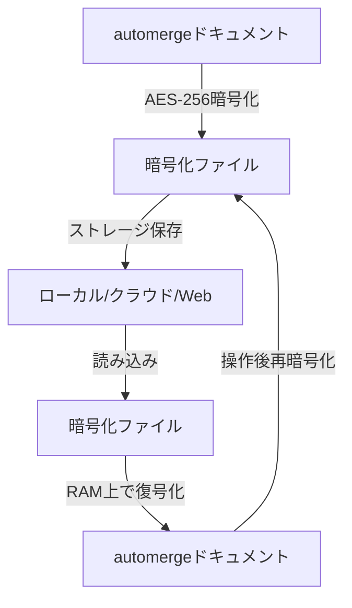
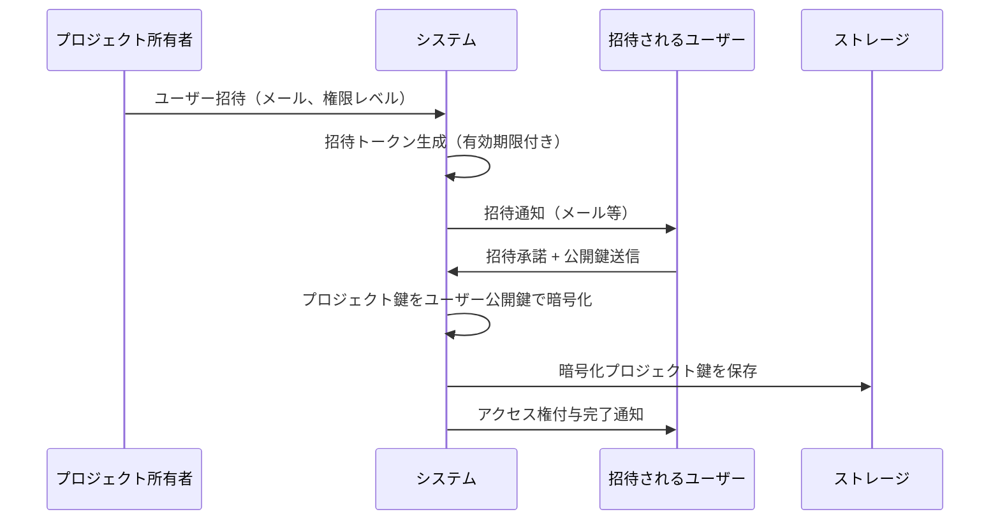
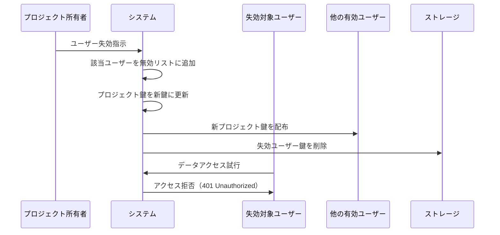

# データセキュリティ設計書（統合版）

## 概要

Flequitタスク管理アプリケーションにおける包括的なデータセキュリティ設計。
データ盗取に対する高度な防御を提供し、実運用に耐える堅牢なセキュリティを実現する。

## 1. データ構造とファイル管理

### 1.1 automergeドキュメント（ファイル）の単位

- **アカウント情報**: アカウントごとに1つのファイル（local-account.am、<account-id>.am）
- **プロジェクト情報**: プロジェクトごとに1つのファイル（<project-id>.am）
  - プロジェクト～サブタスク、協力者の情報などを含む

### 1.2 データ保管先

#### ローカルストレージ
- **Windows**: `C:\Users\<username>\AppData\Local\Flequit`
- **macOS**: `~/Library/Application Support/Flequit`
- **Unix/Linux**:
  1. `$XDG_DATA_HOME/flequit` (環境変数設定時)
  2. `~/.local/share/flequit` (~/.local/shareが存在する場合)
  3. `~/.flequit` (フォールバック)

#### フォルダ構造
```
Flequit/
├── account/
│   ├── local-account.am     # ローカルアカウント（常に1つ）
│   ├── <account-id1>.am     # ログインアカウント
│   └── <account-id2>.am
└── projects/
    ├── <project-id1>.am     # プロジェクトファイル
    ├── <project-id2>.am
    └── <project-id3>.am
```

#### クラウドストレージ・Webサーバー
どちらもアカウント情報に該当ファイルへのパスを持たせる
- **クラウドストレージ**: 任意フォルダを設定
- **Webバックエンド**: Amazon S3等のオブジェクトストレージを想定

## 2. 暗号化システム

### 2.1 基本暗号化方針

- **暗号化アルゴリズム**: AES-256
- **保存形式**: 全automergeドキュメントを暗号化状態で保存
- **実行時**: RAM上でのみ復号化してautomerge操作を実行
- **鍵管理**: 階層的鍵構造による細やかなアクセス制御

### 2.2 暗号化フロー



## 3. アクセス制御システム

### 3.1 基本方針

1. **ローカルアクセス**: 当該デバイス所有者のみアクセス可能
2. **プロジェクト単位制御**: プロジェクトごとに独立したアクセス権限管理
3. **招待制**: 明示的な招待による鍵発行が必要
4. **即座失効**: 任意ユーザーを任意時点で即座にアクセス失効可能
5. **最小権限原則**: 必要最小限の権限のみ付与

### 3.2 権限階層構造

```
ローカルアカウント (デバイス所有者)
├── ログインアカウント1 (サービスアカウント)
│   ├── プロジェクトA (プロジェクト所有者)
│   │   ├── ユーザー1 (編集権限)
│   │   ├── ユーザー2 (読み取り権限)
│   │   └── ユーザー3 (コメント権限)
│   └── プロジェクトB
└── ログインアカウント2
    └── プロジェクトC
```

### 3.3 権限レベル定義

- **所有者**: プロジェクト完全制御（削除、メンバー管理、権限変更）
- **編集者**: データ作成・編集・削除
- **閲覧者**: データ読み取りのみ
- **コメンター**: 閲覧とコメント投稿のみ

## 4. 鍵管理システム

### 4.1 鍵階層構造

1. **マスター鍵**: ローカルアカウントが保持する最上位鍵
2. **アカウント鍵**: ログインアカウント用鍵（マスター鍵で暗号化）
3. **プロジェクト鍵**: プロジェクト用鍵（アカウント鍵で暗号化）
4. **ユーザー専用鍵**: 各ユーザー受取用鍵（プロジェクト鍵をユーザー公開鍵で暗号化）

### 4.2 招待・鍵発行フロー



### 4.3 鍵ローテーション

- **定期ローテーション**: プロジェクト鍵を6ヶ月毎に更新
- **セキュリティ侵害時**: 即座にプロジェクト鍵更新・全ユーザー再配布
- **メンバー変更時**: メンバー追加・削除時にプロジェクト鍵更新

## 5. ユーザー失効システム

### 5.1 即座失効の仕組み

多重防御システムによる確実な失効：

1. **鍵リスト管理**: 有効ユーザー鍵のホワイトリストをプロジェクトメタデータで管理
2. **タイムスタンプベース**: 各ユーザーの最後の有効タイムスタンプを記録
3. **プロジェクト鍵即座更新**: 失効時にプロジェクト鍵を即座に再生成・再配布

### 5.2 失効フロー



### 5.3 失効レベル

- **一時的失効**: 指定期間のみアクセス停止
- **永続的失効**: 完全なアクセス権削除
- **権限降格**: 編集権限から閲覧権限への変更
- **部分失効**: 特定機能のみアクセス制限

### 5.4 緊急時対応

- **不正アクセス検知時**: 全ユーザー一時失効・再認証要求
- **デバイス紛失時**: 該当デバイスローカル鍵無効化
- **退職・離脱時**: 全プロジェクトから即座除名

## 6. プロジェクト単位権限管理

### 6.1 同期方式別権限実装

#### ローカル専用
- デバイス所有者が全権限保持
- OSレベルファイルアクセス制御に依存
- マルチユーザー環境では追加暗号化実装

#### クラウドストレージ同期
- プロジェクトディレクトリごと独立暗号化
- 共有フォルダ招待 = プロジェクト鍵共有
- ストレージプロバイダー権限管理と連携

#### Web同期
- サーバーサイド細かい権限制御
- APIレベル操作権限チェック
- 監査ログ詳細記録

### 6.2 権限マトリックス

| 操作 | 所有者 | 編集者 | 閲覧者 | コメンター |
|------|--------|--------|--------|------------|
| プロジェクト削除 | ✓ | ✗ | ✗ | ✗ |
| メンバー招待 | ✓ | ✗ | ✗ | ✗ |
| メンバー除名 | ✓ | ✗ | ✗ | ✗ |
| 権限変更 | ✓ | ✗ | ✗ | ✗ |
| タスク作成・編集 | ✓ | ✓ | ✗ | ✗ |
| タスク削除 | ✓ | ✓ | ✗ | ✗ |
| タスク閲覧 | ✓ | ✓ | ✓ | ✓ |
| コメント投稿 | ✓ | ✓ | ✗ | ✓ |
| ファイル添付 | ✓ | ✓ | ✗ | ✓ |
| エクスポート | ✓ | ✓ | ✓ | ✗ |

### 6.3 セキュリティ境界

1. **プロジェクト境界**: プロジェクト間データ完全分離
2. **ユーザー境界**: アクセス権保持プロジェクトのみ参照可能
3. **デバイス境界**: デバイス紛失時も他デバイスに影響なし
4. **時間境界**: 失効処理により過去鍵では新データアクセス不可

## 7. 今後実装すべきセキュリティ項目

### 7.1 高優先度（Phase 1）

#### 脅威モデル分析
- **想定攻撃シナリオ**: マルウェア感染、フィッシング、内部不正、物理的アクセス
- **攻撃ベクター分析**: ネットワーク、エンドポイント、ソーシャルエンジニアリング
- **リスク評価マトリックス**: 影響度×発生確率による優先度付け

#### 実装セキュリティ
- **メモリ保護**: 秘密鍵のメモリクリア、ヒープダンプ対策
- **サイドチャネル攻撃対策**: タイミング攻撃、電力解析攻撃への対策
- **デバッグ情報対策**: 本番環境でのデバッグ情報除去

#### 監査・ログシステム
- **操作ログ**: 全ユーザー操作の詳細記録
- **セキュリティイベント**: 認証失敗、不正アクセス試行の記録
- **改ざん検知**: ログの整合性検証機能

### 7.2 中優先度（Phase 2）

#### バックアップ・リカバリ
- **鍵バックアップ戦略**: 秘密分散法を用いた鍵分割保存
- **災害復旧計画**: データ復旧手順とRTO/RPO定義
- **鍵紛失対応**: マスター鍵紛失時の復旧手順

#### デバイス管理
- **デバイス登録**: 信頼済みデバイスの管理システム
- **デバイス認証**: 証明書ベースのデバイス認証
- **リモートワイプ**: 紛失デバイスのデータ遠隔消去

#### 通信セキュリティ
- **証明書ピニング**: 中間者攻撃対策
- **通信暗号化**: TLS 1.3以上の強制、Perfect Forward Secrecy
- **API認証**: JWT + OAuth 2.0 / OpenID Connectの実装

### 7.3 低優先度（Phase 3）

#### 高度な攻撃対策
- **ゼロトラスト**: 全通信の暗号化・認証
- **AIベース異常検知**: 行動分析による不正アクセス検知
- **ハードウェアセキュリティ**: TPM、HSM活用

#### コンプライアンス
- **GDPR対応**: 個人データ保護、削除権実装
- **SOC 2 Type II**: セキュリティ管理体制の第三者監査
- **ISO 27001**: 情報セキュリティマネジメントシステム

#### パフォーマンス最適化
- **暗号化性能**: ハードウェア暗号化機能の活用
- **鍵キャッシュ**: セキュアな鍵キャッシュシステム
- **並列処理**: 暗号化処理の並列化

## 8. セキュリティ実装ガイドライン

### 8.1 開発時の原則

1. **Secure by Default**: デフォルトで最も安全な設定
2. **Defense in Depth**: 多層防御による堅牢性確保
3. **Principle of Least Privilege**: 最小権限の徹底
4. **Fail Securely**: 障害時も安全な状態を維持
5. **Security Testing**: セキュリティテストの自動化

### 8.2 コードレビュー観点

- 秘密情報のハードコーディング禁止
- 入力値検証の徹底
- SQL/NoSQLインジェクション対策
- XSS/CSRF対策の実装
- 暗号化実装の正確性検証

### 8.3 運用時の監視項目

- 異常な認証試行パターン
- 大量データアクセス
- 権限昇格試行
- システムリソース異常使用
- 暗号化処理の異常
