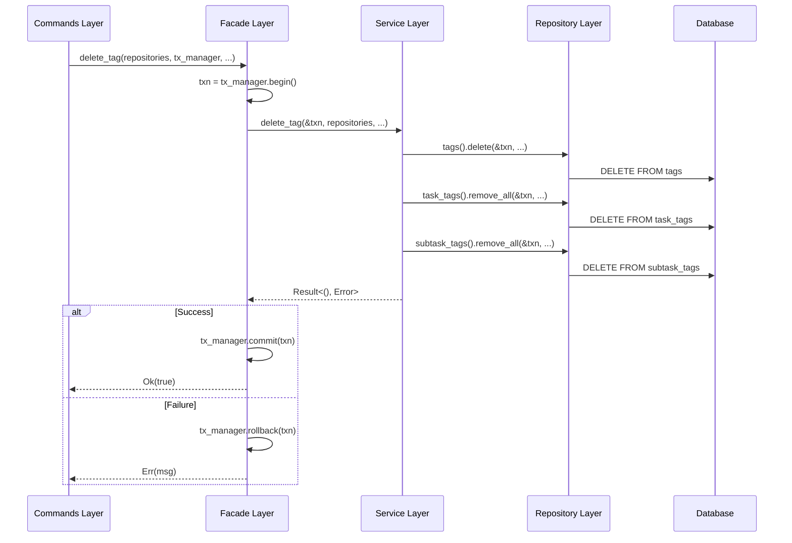

# Transaction Management Design Document

## 1. Overview

### 1.1 Purpose

This document defines the design of database transaction management in the Flequit application. By centralizing transaction management in the Facade layer, we ensure data consistency and clarify responsibilities.

### 1.2 Design Principles

#### Separation of Transaction Management Responsibilities

- **Facade Layer**: Controls transaction boundaries and coordinates overall business flow
- **Service Layer**: Implements business logic (receives and uses transactions)
- **Repository Layer**: Implements data access logic (does not control transactions)

#### Data Consistency Guarantee

- Multiple Repository operations execute within a single transaction
- Strict adherence to ACID properties (SQLite)
- Reliable rollback on error occurrence

## 2. Architecture Design

### 2.1 Layer Structure and Responsibilities

```
┌─────────────────────────────────────────────┐
│ Commands Layer                               │
│ - Tauri command handlers                    │
│ - Get repositories + tx_manager from AppState│
│ - Call Facade layer                          │
└─────────────────┬───────────────────────────┘
                  ↓
┌─────────────────────────────────────────────┐
│ Facade Layer ★Transaction Control            │
│ - tx_manager.begin() to start transaction   │
│ - Call Service layer                         │
│ - On success: tx_manager.commit()           │
│ - On failure: tx_manager.rollback()         │
└─────────────────┬───────────────────────────┘
                  ↓
┌─────────────────────────────────────────────┐
│ Service Layer                                │
│ - Implement business logic                  │
│ - Receive transaction object                │
│ - Pass to Repository layer                   │
└─────────────────┬───────────────────────────┘
                  ↓
┌─────────────────────────────────────────────┐
│ Repository Layer                             │
│ - Implement data access logic               │
│ - Operate with passed transaction object    │
│ - Do not commit/rollback                     │
└─────────────────────────────────────────────┘
```

### 2.2 Transaction Management Flow



## 3. Implementation Specification

### 3.1 TransactionManager Trait

**Location**: `flequit-model/src/traits/transaction.rs`

```rust
use async_trait::async_trait;
use flequit_types::errors::repository_error::RepositoryError;

/// Abstract interface for transaction management
#[async_trait]
pub trait TransactionManager: Send + Sync {
    /// Transaction object type
    type Transaction: Send + Sync;

    /// Begin a transaction
    ///
    /// # Returns
    /// Started transaction object
    async fn begin(&self) -> Result<Self::Transaction, RepositoryError>;

    /// Commit a transaction
    ///
    /// # Arguments
    /// * `txn` - Transaction to commit
    async fn commit(&self, txn: Self::Transaction) -> Result<(), RepositoryError>;

    /// Rollback a transaction
    ///
    /// # Arguments
    /// * `txn` - Transaction to rollback
    async fn rollback(&self, txn: Self::Transaction) -> Result<(), RepositoryError>;
}
```

### 3.2 SQLite Implementation

**Location**: `flequit-infrastructure-sqlite/src/infrastructure/database_manager.rs`

```rust
use crate::traits::TransactionManager;
use sea_orm::{DatabaseConnection, DatabaseTransaction, TransactionTrait};

#[async_trait]
impl TransactionManager for DatabaseManager {
    type Transaction = DatabaseTransaction;

    async fn begin(&self) -> Result<Self::Transaction, RepositoryError> {
        let db = self.get_connection().await?;
        db.begin()
            .await
            .map_err(|e| RepositoryError::from(SQLiteError::from(e)))
    }

    async fn commit(&self, txn: Self::Transaction) -> Result<(), RepositoryError> {
        txn.commit()
            .await
            .map_err(|e| RepositoryError::from(SQLiteError::from(e)))
    }

    async fn rollback(&self, txn: Self::Transaction) -> Result<(), RepositoryError> {
        txn.rollback()
            .await
            .map_err(|e| RepositoryError::from(SQLiteError::from(e)))
    }
}
```

### 3.3 AppState Structure

**Location**: `src-tauri/src/lib.rs`

```rust
pub struct AppState {
    pub repositories: Arc<InfrastructureRepositories>,
    pub transaction_manager: Arc<dyn TransactionManager<Transaction = DatabaseTransaction>>,
}
```

### 3.4 Facade Layer Implementation Pattern

**Location**: `flequit-core/src/facades/tag_facades.rs`

```rust
pub async fn delete_tag<R, TM>(
    repositories: &R,
    tx_manager: &TM,
    project_id: &ProjectId,
    id: &TagId,
) -> Result<bool, String>
where
    R: InfrastructureRepositoriesTrait + Send + Sync,
    TM: TransactionManager + Send + Sync,
{
    // Begin transaction
    let txn = tx_manager.begin().await
        .map_err(|e| format!("Failed to begin transaction: {:?}", e))?;

    // Execute business logic
    match tag_service::delete_tag(&txn, repositories, project_id, id).await {
        Ok(_) => {
            // On success: commit
            tx_manager.commit(txn).await
                .map_err(|e| format!("Failed to commit transaction: {:?}", e))?;
            Ok(true)
        }
        Err(e) => {
            // On failure: rollback
            // Ignore rollback errors (already in error state)
            let _ = tx_manager.rollback(txn).await;
            Err(format!("Failed to delete tag: {:?}", e))
        }
    }
}
```

### 3.5 Service Layer Implementation Pattern

**Location**: `flequit-core/src/services/tag_service.rs`

```rust
pub async fn delete_tag<R, T>(
    txn: &T,
    repositories: &R,
    project_id: &ProjectId,
    tag_id: &TagId,
) -> Result<(), ServiceError>
where
    R: InfrastructureRepositoriesTrait + Send + Sync,
    T: ConnectionTrait + Send + Sync,  // Sea-ORM trait
{
    // Execute multiple Repository operations within the same transaction
    repositories.tags().delete(txn, project_id, tag_id).await?;
    repositories.task_tags().remove_all_relations_by_tag_id(txn, project_id, tag_id).await?;
    repositories.subtask_tags().remove_all_relations_by_tag_id(txn, project_id, tag_id).await?;
    repositories.tag_bookmarks().delete_by_tag(txn, project_id, tag_id).await?;

    Ok(())
}
```

### 3.6 Repository Layer Implementation Pattern

**Location**: `flequit-infrastructure-sqlite/src/infrastructure/task_projects/tag.rs`

```rust
use sea_orm::ConnectionTrait;

impl TagLocalSqliteRepository {
    /// Delete a tag (receives transaction connection)
    pub async fn delete<C>(
        &self,
        conn: &C,
        project_id: &ProjectId,
        tag_id: &TagId,
    ) -> Result<(), RepositoryError>
    where
        C: ConnectionTrait,
    {
        TagEntity::delete_by_id((project_id.to_string(), tag_id.to_string()))
            .exec(conn)
            .await
            .map_err(|e| RepositoryError::from(SQLiteError::from(e)))?;

        Ok(())
    }
}
```

## 4. Database-Specific Handling

### 4.1 SQLite

- **Transaction**: Required
- **Implementation**: Managed by `TransactionManager` trait
- **Characteristics**: Strictly guarantees ACID properties

### 4.2 Automerge

- **Transaction**: Not required
- **Implementation**: Process individually
- **Characteristics**: Guarantees eventual consistency through CRDT (Conflict-free Replicated Data Type)

### 4.3 Distribution in UnifiedRepository

```rust
impl TagUnifiedRepository {
    pub async fn delete<C>(
        &self,
        conn: &C,
        project_id: &ProjectId,
        tag_id: &TagId,
    ) -> Result<(), RepositoryError>
    where
        C: ConnectionTrait,
    {
        for repository in &self.save_repositories {
            match repository {
                TagRepositoryVariant::LocalSqlite(repo) => {
                    // SQLite: Use transaction connection
                    repo.delete(conn, project_id, tag_id).await?;
                }
                TagRepositoryVariant::LocalAutomerge(repo) => {
                    // Automerge: Normal deletion (no transaction needed)
                    repo.delete(project_id, tag_id).await?;
                }
            }
        }
        Ok(())
    }
}
```

## 5. Error Handling

### 5.1 Transaction Start Failure

```rust
let txn = tx_manager.begin().await
    .map_err(|e| format!("Failed to begin transaction: {:?}", e))?;
```

- Database connection error
- Resource shortage
- → Return error and handle in Facade layer

### 5.2 Business Logic Failure

```rust
match tag_service::delete_tag(&txn, repositories, project_id, id).await {
    Ok(_) => { /* commit */ },
    Err(e) => {
        let _ = tx_manager.rollback(txn).await;  // Rollback
        Err(format!("Failed to delete tag: {:?}", e))
    }
}
```

- Validation error
- Foreign key constraint violation
- → Rollback to discard all changes

### 5.3 Commit Failure

```rust
tx_manager.commit(txn).await
    .map_err(|e| format!("Failed to commit transaction: {:?}", e))?;
```

- Disk space shortage
- Database corruption
- → Return error (automatic rollback)

### 5.4 Rollback Failure

```rust
let _ = tx_manager.rollback(txn).await;  // Ignore error
```

- Ignore rollback errors (already in error state)
- Log and continue

## 6. Transaction Isolation Level

### 6.1 SQLite

Default: **SERIALIZABLE** (most strict)

- Complete isolation guarantee
- Read consistency
- No phantom reads

### 6.2 Future Extensions

Can add isolation level specification to TransactionManager:

```rust
#[async_trait]
pub trait TransactionManager: Send + Sync {
    type Transaction: Send + Sync;

    async fn begin(&self) -> Result<Self::Transaction, RepositoryError>;

    // Future extension
    async fn begin_with_isolation(
        &self,
        level: IsolationLevel,
    ) -> Result<Self::Transaction, RepositoryError>;
}

pub enum IsolationLevel {
    ReadUncommitted,
    ReadCommitted,
    RepeatableRead,
    Serializable,
}
```

## 7. Performance Considerations

### 7.1 Minimize Transaction Duration

**Good example**:
```rust
// Preparation outside transaction
let validation_result = validate_tag_data(tag)?;

// Begin transaction
let txn = tx_manager.begin().await?;

// Execute only minimal operations within transaction
repositories.tags().delete(&txn, project_id, tag_id).await?;

tx_manager.commit(txn).await?;
```

**Bad example**:
```rust
let txn = tx_manager.begin().await?;

// Long-running processes within transaction (NG)
let validation_result = validate_tag_data(tag)?;
let related_data = fetch_all_related_data().await?;
process_complex_logic(related_data)?;

repositories.tags().delete(&txn, project_id, tag_id).await?;
tx_manager.commit(txn).await?;
```

### 7.2 Read-Only Operations

Read-only operations don't need transactions:

```rust
// No transaction needed
let tag = repositories.tags().find_by_id(project_id, tag_id).await?;

// Transaction needed (update operation)
let txn = tx_manager.begin().await?;
repositories.tags().delete(&txn, project_id, tag_id).await?;
tx_manager.commit(txn).await?;
```

### 7.3 Batch Operation Optimization

Process multiple records in a single transaction:

```rust
let txn = tx_manager.begin().await?;

for tag_id in tag_ids {
    repositories.tags().delete(&txn, project_id, &tag_id).await?;
}

tx_manager.commit(txn).await?;
```

## 8. Testing Strategy

### 8.1 Unit Tests

```rust
#[cfg(test)]
mod tests {
    use super::*;
    use mockall::mock;

    mock! {
        TransactionManager {}

        #[async_trait]
        impl TransactionManager for TransactionManager {
            type Transaction = MockTransaction;

            async fn begin(&self) -> Result<Self::Transaction, RepositoryError>;
            async fn commit(&self, txn: Self::Transaction) -> Result<(), RepositoryError>;
            async fn rollback(&self, txn: Self::Transaction) -> Result<(), RepositoryError>;
        }
    }

    #[tokio::test]
    async fn test_delete_tag_commits_on_success() {
        let mut tx_manager = MockTransactionManager::new();
        tx_manager.expect_begin().returning(|| Ok(MockTransaction::new()));
        tx_manager.expect_commit().returning(|_| Ok(()));

        let result = delete_tag(&repositories, &tx_manager, &project_id, &tag_id).await;
        assert!(result.is_ok());
    }

    #[tokio::test]
    async fn test_delete_tag_rollbacks_on_error() {
        let mut tx_manager = MockTransactionManager::new();
        tx_manager.expect_begin().returning(|| Ok(MockTransaction::new()));
        tx_manager.expect_rollback().returning(|_| Ok(()));

        // Mock repository to return error
        let result = delete_tag(&repositories, &tx_manager, &project_id, &tag_id).await;
        assert!(result.is_err());
    }
}
```

### 8.2 Integration Tests

```rust
#[tokio::test]
async fn test_tag_deletion_data_consistency() {
    let db_manager = setup_test_database().await;
    let repositories = setup_test_repositories(&db_manager).await;

    // Prepare test data
    create_test_tag(&repositories, &project_id, &tag_id).await;
    create_test_task_tag(&repositories, &project_id, &task_id, &tag_id).await;

    // Execute tag deletion
    let result = delete_tag(&repositories, &db_manager, &project_id, &tag_id).await;
    assert!(result.is_ok());

    // Verify data consistency
    let tag = repositories.tags().find_by_id(&project_id, &tag_id).await.unwrap();
    assert!(tag.is_none(), "Tag should be deleted");

    let task_tags = repositories.task_tags()
        .find_by_tag_id(&project_id, &tag_id).await.unwrap();
    assert!(task_tags.is_empty(), "Task tags should be deleted");
}

#[tokio::test]
async fn test_tag_deletion_rollback_on_error() {
    let db_manager = setup_test_database().await;
    let repositories = setup_test_repositories(&db_manager).await;

    // Prepare test data
    create_test_tag(&repositories, &project_id, &tag_id).await;

    // Create condition to cause error
    // (e.g., cause foreign key constraint violation)
    create_locked_reference(&repositories, &tag_id).await;

    // Execute tag deletion (should fail)
    let result = delete_tag(&repositories, &db_manager, &project_id, &tag_id).await;
    assert!(result.is_err());

    // Verify data is unchanged
    let tag = repositories.tags().find_by_id(&project_id, &tag_id).await.unwrap();
    assert!(tag.is_some(), "Tag should still exist after rollback");
}
```

## 9. Best Practices

### 9.1 Transaction Control Rules

1. **Start transactions only in Facade layer**
   - Prohibit transaction start in Service layer and below
   - Prevent nested transactions

2. **Explicit commit/rollback**
   - Don't rely on auto-commit
   - Always rollback on error

3. **Minimize transaction duration**
   - Execute preparation outside transaction
   - Execute only database operations within transaction

4. **Read-only operations don't need transactions**
   - SELECT-only operations don't need transactions
   - Performance improvement

### 9.2 Error Handling Rules

1. **Ignore rollback errors**
   - Already in error state
   - Log and continue

2. **Clear error messages**
   - Transaction start failure
   - Business logic failure
   - Commit failure
   - Distinguish each type with messages

3. **Retry strategy**
   - Automatic retry for deadlocks
   - Other errors judged by caller

### 9.3 Code Review Checklist

- [ ] Are transactions started only in Facade layer?
- [ ] Commits on success, rollbacks on failure?
- [ ] Is transaction duration minimized?
- [ ] No unnecessary transactions for read-only operations?
- [ ] Is error handling appropriate?
- [ ] Are test cases sufficient?

## 10. References

- [Sea-ORM Transaction Documentation](https://www.sea-ql.org/SeaORM/docs/advanced-query/transaction/)
- [SQLite Transaction](https://www.sqlite.org/lang_transaction.html)
- [Rust async/await](https://rust-lang.github.io/async-book/)
- [ACID Properties](https://en.wikipedia.org/wiki/ACID)

## 11. Change History

| Date | Version | Changes | Author |
|------|---------|---------|--------|
| 2025-11-22 | 1.0 | Initial version | - |
