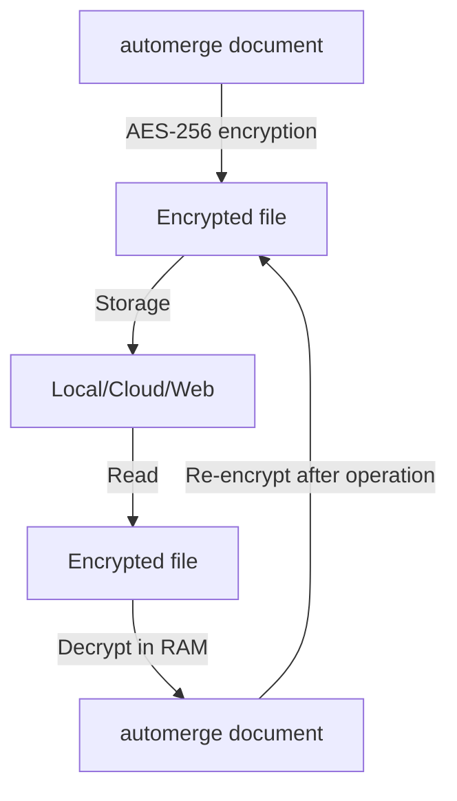
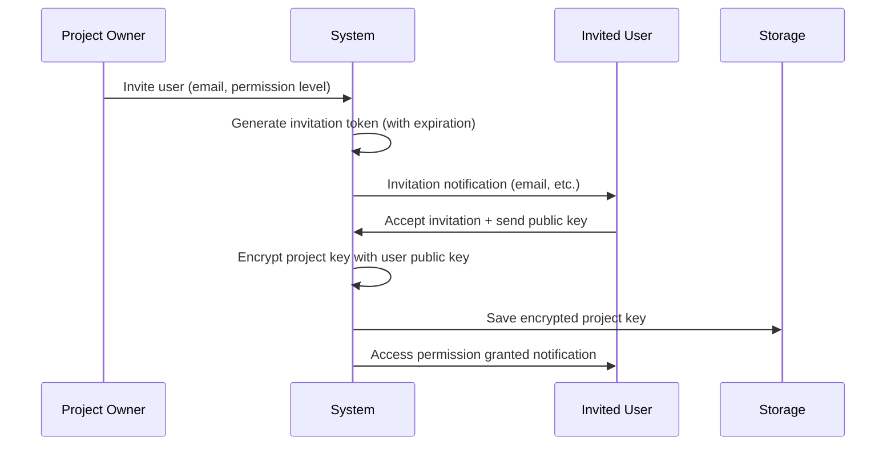
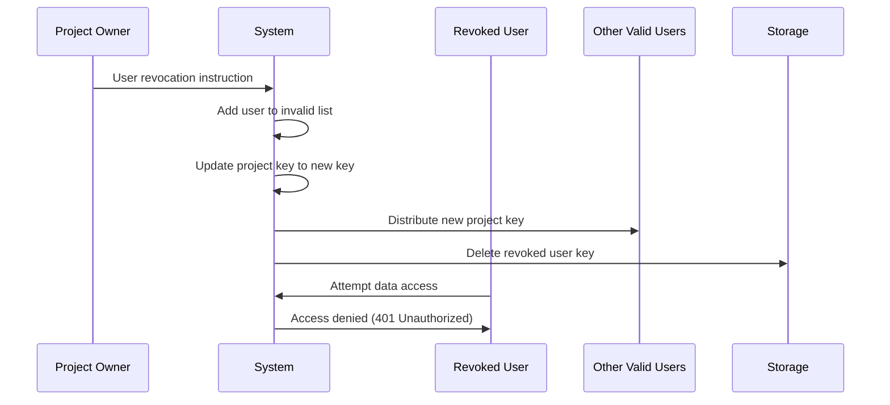

# Data Security Design Document (Integrated Version)

## Overview

Comprehensive data security design for the Flequit task management application.
Provides advanced defense against data theft and achieves robust security suitable for production use.

## 1. ID Design and Security

### 1.1 Dual ID Design

For security enhancement, account and user information adopt a dual ID structure:

#### Internal ID vs Public ID

| Type                    | Purpose                        | Security Level           | Usage Scenarios                           |
| ----------------------- | ------------------------------ | ------------------------ | ----------------------------------------- |
| **Internal ID (id)**    | System internal identification | Confidential information | Database primary key, internal processing |
| **Public ID (user_id)** | External reference and sharing | Public information       | Project participation, task assignment    |

#### Account Structure

```json
{
  "id": "account-internal-uuid", // Internal ID - absolutely confidential
  "user_id": "user-public-uuid", // Public ID - for external reference
  "email": "user@example.com",
  "provider": "local"
}
```

#### User Structure

```json
{
  "id": "user-public-uuid", // Public ID - for external reference (all information is public)
  "username": "username",
  "display_name": "Display Name"
}
```

### 1.2 Security Principles

1. **Internal ID Protection**: Absolutely prohibit leakage outside the system
2. **Public ID Usage**: Use only public IDs for project sharing and invitations
3. **ID Separation**: Clearly separate IDs used for internal processing and external collaboration
4. **Leakage Countermeasures**: Make reverse lookup from public ID difficult even if internal ID is leaked

### 1.3 Implementation Guidelines

#### Development Considerations

- Do not include internal IDs in API responses (Account.id only)
- Record only public IDs in logs (Account.user_id, User.id)
- Do not display internal IDs in error messages
- Handle only public IDs in frontend processing (Account.user_id, User.id)

#### Database Design

- Account reference: Use `Account.user_id` (public ID)
- User reference: Use `User.id` (public ID)
- ID conversion for JOIN queries (internal processing only)
- Index settings: Both Account IDs, single User ID

## 2. Data Structure and File Management

### 2.1 Automerge Document (File) Units

- **Account Information**: One file per account (local-account.am, <account-id>.am)
- **Project Information**: One file per project (<project-id>.am)
  - Contains project to subtask and collaborator information

### 2.2 Data Storage Locations

#### Local Storage

- **Windows**: `C:\Users\<username>\AppData\Local\Flequit`
- **macOS**: `~/Library/Application Support/Flequit`
- **Unix/Linux**:
  1. `$XDG_DATA_HOME/flequit` (when environment variable is set)
  2. `~/.local/share/flequit` (when ~/.local/share exists)
  3. `~/.flequit` (fallback)

#### Folder Structure

```
Flequit/
├── account/
│   ├── local-account.am     # Local account (always one)
│   ├── <account-id1>.am     # Login account
│   └── <account-id2>.am
└── projects/
    ├── <project-id1>.am     # Project files
    ├── <project-id2>.am
    └── <project-id3>.am
```

#### Cloud Storage and Web Server

Both store account information with file paths

- **Cloud Storage**: Set arbitrary folder
- **Web Backend**: Assume object storage like Amazon S3

## 3. Encryption System

### 3.1 Basic Encryption Policy

- **Encryption Algorithm**: AES-256
- **Storage Format**: All automerge documents stored encrypted
- **Runtime**: Decrypt only in RAM for automerge operations
- **Key Management**: Hierarchical key structure for fine-grained access control

### 3.2 Encryption Flow



## 4. Access Control System

### 4.1 Basic Policy

1. **Local Access**: Only device owner can access
2. **Project-level Control**: Independent access permission management per project
3. **Invitation System**: Explicit invitation required for key issuance
4. **Immediate Revocation**: Any user can be immediately revoked at any time
5. **Principle of Least Privilege**: Grant only minimum necessary permissions

### 4.2 Permission Hierarchy Structure

```
Local Account (Device Owner)
├── Login Account 1 (Service Account)
│   ├── Project A (Project Owner)
│   │   ├── User 1 (Edit Permission)
│   │   ├── User 2 (Read Permission)
│   │   └── User 3 (Comment Permission)
│   └── Project B
└── Login Account 2
    └── Project C
```

### 4.3 Permission Level Definitions

- **Owner**: Full project control (delete, member management, permission changes)
- **Editor**: Create, edit, delete data
- **Viewer**: Read data only
- **Commenter**: View and post comments only

## 5. Key Management System

### 5.1 Key Hierarchy Structure

1. **Master Key**: Top-level key held by local account
2. **Account Key**: Login account key (encrypted with master key)
3. **Project Key**: Project key (encrypted with account key)
4. **User-specific Key**: Key for each user (project key encrypted with user public key)

### 5.2 Invitation and Key Issuance Flow



### 5.3 Key Rotation

- **Regular Rotation**: Update project keys every 6 months
- **Security Breach**: Immediately update project keys and redistribute to all users
- **Member Changes**: Update project keys when adding or removing members

## 6. User Revocation System

### 6.1 Immediate Revocation Mechanism

Multi-layered defense system for reliable revocation:

1. **Key List Management**: Manage valid user keys whitelist in project metadata
2. **Timestamp-based**: Record each user's last valid timestamp
3. **Immediate Project Key Update**: Immediately regenerate and redistribute project keys upon revocation

### 6.2 Revocation Flow



### 6.3 Revocation Levels

- **Temporary Revocation**: Access suspension for specified period only
- **Permanent Revocation**: Complete access right removal
- **Permission Demotion**: Change from edit to view permission
- **Partial Revocation**: Restrict access to specific functions only

### 6.4 Emergency Response

- **Unauthorized Access Detection**: Temporarily revoke all users and require re-authentication
- **Device Loss**: Invalidate local keys for the lost device
- **Resignation/Departure**: Immediately remove from all projects

## 7. Project-level Permission Management

### 7.1 Permission Implementation by Sync Method

#### Local Only

- Device owner holds all permissions
- Depends on OS-level file access control
- Additional encryption implementation for multi-user environments

#### Cloud Storage Sync

- Independent encryption per project directory
- Shared folder invitation = project key sharing
- Integration with storage provider permission management

#### Web Sync

- Server-side fine-grained permission control
- API-level operation permission checks
- Detailed audit log recording

### 7.2 Permission Matrix

| Operation          | Owner | Editor | Viewer | Commenter |
| ------------------ | ----- | ------ | ------ | --------- |
| Delete Project     | ✓     | ✗      | ✗      | ✗         |
| Invite Members     | ✓     | ✗      | ✗      | ✗         |
| Remove Members     | ✓     | ✗      | ✗      | ✗         |
| Change Permissions | ✓     | ✗      | ✗      | ✗         |
| Create/Edit Tasks  | ✓     | ✓      | ✗      | ✗         |
| Delete Tasks       | ✓     | ✓      | ✗      | ✗         |
| View Tasks         | ✓     | ✓      | ✓      | ✓         |
| Post Comments      | ✓     | ✓      | ✗      | ✓         |
| Attach Files       | ✓     | ✓      | ✗      | ✓         |
| Export             | ✓     | ✓      | ✓      | ✗         |

### 7.3 Security Boundaries

1. **Project Boundary**: Complete data separation between projects
2. **User Boundary**: Can only reference projects with access rights
3. **Device Boundary**: No impact on other devices when device is lost
4. **Time Boundary**: New data cannot be accessed with past keys due to revocation processing

## 8. Future Security Implementation Items

### 8.1 High Priority (Phase 1)

#### Threat Model Analysis

- **Assumed Attack Scenarios**: Malware infection, phishing, internal fraud, physical access
- **Attack Vector Analysis**: Network, endpoint, social engineering
- **Risk Assessment Matrix**: Priority setting by impact × probability

#### Implementation Security

- **Memory Protection**: Memory clearing of secret keys, heap dump countermeasures
- **Side-channel Attack Countermeasures**: Countermeasures against timing attacks, power analysis attacks
- **Debug Information Countermeasures**: Remove debug information in production environment

#### Audit and Log System

- **Operation Logs**: Detailed recording of all user operations
- **Security Events**: Recording of authentication failures, unauthorized access attempts
- **Tampering Detection**: Log integrity verification functionality

### 8.2 Medium Priority (Phase 2)

#### Backup and Recovery

- **Key Backup Strategy**: Key split storage using secret sharing
- **Disaster Recovery Plan**: Data recovery procedures and RTO/RPO definition
- **Key Loss Response**: Recovery procedures when master key is lost

#### Device Management

- **Device Registration**: Trusted device management system
- **Device Authentication**: Certificate-based device authentication
- **Remote Wipe**: Remote data deletion for lost devices

#### Communication Security

- **Certificate Pinning**: Countermeasures against man-in-the-middle attacks
- **Communication Encryption**: TLS 1.3+ enforcement, Perfect Forward Secrecy
- **API Authentication**: JWT + OAuth 2.0 / OpenID Connect implementation

### 8.3 Low Priority (Phase 3)

#### Advanced Attack Countermeasures

- **Zero Trust**: Encryption and authentication of all communications
- **AI-based Anomaly Detection**: Unauthorized access detection through behavioral analysis
- **Hardware Security**: TPM, HSM utilization

#### Compliance

- **GDPR Compliance**: Personal data protection, deletion right implementation
- **SOC 2 Type II**: Third-party audit of security management system
- **ISO 27001**: Information security management system

#### Performance Optimization

- **Encryption Performance**: Hardware encryption function utilization
- **Key Caching**: Secure key caching system
- **Parallel Processing**: Encryption processing parallelization

## 9. Security Implementation Guidelines

### 9.1 Development Principles

1. **Secure by Default**: Most secure settings by default
2. **Defense in Depth**: Robustness through multi-layered defense
3. **Principle of Least Privilege**: Thorough minimum privilege
4. **Fail Securely**: Maintain safe state even during failures
5. **Security Testing**: Automate security testing

### 9.2 Code Review Perspectives

- Prohibit hardcoding of secret information
- Thorough input validation
- SQL/NoSQL injection countermeasures
- XSS/CSRF countermeasure implementation
- Verify encryption implementation accuracy

### 9.3 Operational Monitoring Items

- Abnormal authentication attempt patterns
- Large-scale data access
- Privilege escalation attempts
- Abnormal system resource usage
- Encryption processing abnormalities
