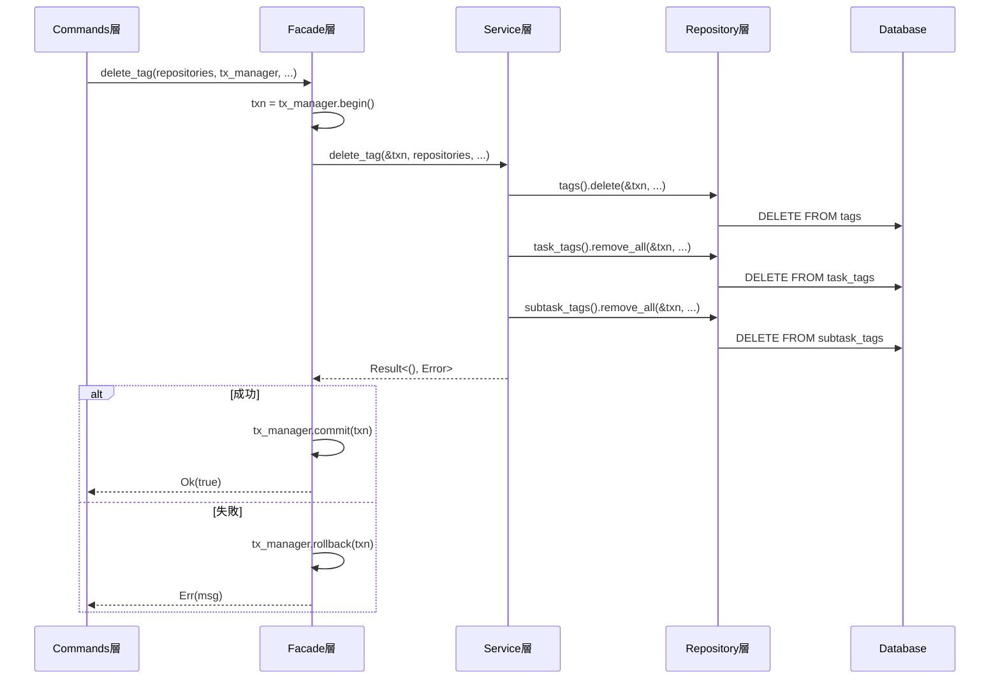

# トランザクション管理設計書

## 1. 概要

### 1.1 目的

本ドキュメントは、Flequitアプリケーションにおけるデータベーストランザクション管理の設計を定義する。Facade層でトランザクションを一元管理することで、データ整合性を保証し、責務を明確化する。

### 1.2 設計原則

#### トランザクション管理の責務分離

- **Facade層**: トランザクション境界の制御とビジネスフロー全体の調整
- **Service層**: ビジネスロジックの実装（トランザクションを受け取り利用）
- **Repository層**: データアクセスロジックの実装（トランザクション制御は行わない）

#### データ整合性の保証

- 複数のRepository操作は単一トランザクション内で実行
- ACID特性の厳格な遵守（SQLite）
- エラー発生時の確実なロールバック

## 2. アーキテクチャ設計

### 2.1 レイヤー構成と責務

```
┌─────────────────────────────────────────────┐
│ Commands層                                   │
│ - Tauri コマンドハンドラー                   │
│ - AppStateからrepositories + tx_managerを取得│
│ - Facade層の呼び出し                         │
└─────────────────┬───────────────────────────┘
                  ↓
┌─────────────────────────────────────────────┐
│ Facade層 ★トランザクション制御の責務         │
│ - tx_manager.begin() でトランザクション開始  │
│ - Service層の呼び出し                        │
│ - 成功時: tx_manager.commit()               │
│ - 失敗時: tx_manager.rollback()             │
└─────────────────┬───────────────────────────┘
                  ↓
┌─────────────────────────────────────────────┐
│ Service層                                    │
│ - ビジネスロジックの実装                    │
│ - トランザクションオブジェクトを受け取る    │
│ - Repository層に渡す                         │
└─────────────────┬───────────────────────────┘
                  ↓
┌─────────────────────────────────────────────┐
│ Repository層                                 │
│ - データアクセスロジックの実装              │
│ - 渡されたトランザクションオブジェクトで操作│
│ - commit/rollbackは行わない                  │
└─────────────────────────────────────────────┘
```

### 2.2 トランザクション管理のフロー



## 3. 実装仕様

### 3.1 TransactionManagerトレイト

**場所**: `flequit-model/src/traits/transaction.rs`

```rust
use async_trait::async_trait;
use flequit_types::errors::repository_error::RepositoryError;

/// トランザクション管理の抽象インターフェース
#[async_trait]
pub trait TransactionManager: Send + Sync {
    /// トランザクションオブジェクトの型
    type Transaction: Send + Sync;

    /// トランザクションを開始
    ///
    /// # Returns
    /// 開始されたトランザクションオブジェクト
    async fn begin(&self) -> Result<Self::Transaction, RepositoryError>;

    /// トランザクションをコミット
    ///
    /// # Arguments
    /// * `txn` - コミットするトランザクション
    async fn commit(&self, txn: Self::Transaction) -> Result<(), RepositoryError>;

    /// トランザクションをロールバック
    ///
    /// # Arguments
    /// * `txn` - ロールバックするトランザクション
    async fn rollback(&self, txn: Self::Transaction) -> Result<(), RepositoryError>;
}
```

### 3.2 SQLite実装

**場所**: `flequit-infrastructure-sqlite/src/infrastructure/database_manager.rs`

```rust
use crate::traits::TransactionManager;
use sea_orm::{DatabaseConnection, DatabaseTransaction, TransactionTrait};

#[async_trait]
impl TransactionManager for DatabaseManager {
    type Transaction = DatabaseTransaction;

    async fn begin(&self) -> Result<Self::Transaction, RepositoryError> {
        let db = self.get_connection().await?;
        db.begin()
            .await
            .map_err(|e| RepositoryError::from(SQLiteError::from(e)))
    }

    async fn commit(&self, txn: Self::Transaction) -> Result<(), RepositoryError> {
        txn.commit()
            .await
            .map_err(|e| RepositoryError::from(SQLiteError::from(e)))
    }

    async fn rollback(&self, txn: Self::Transaction) -> Result<(), RepositoryError> {
        txn.rollback()
            .await
            .map_err(|e| RepositoryError::from(SQLiteError::from(e)))
    }
}
```

### 3.3 AppState構造体

**場所**: `src-tauri/src/lib.rs`

```rust
pub struct AppState {
    pub repositories: Arc<InfrastructureRepositories>,
    pub transaction_manager: Arc<dyn TransactionManager<Transaction = DatabaseTransaction>>,
}
```

### 3.4 Facade層の実装パターン

**場所**: `flequit-core/src/facades/tag_facades.rs`

```rust
pub async fn delete_tag<R, TM>(
    repositories: &R,
    tx_manager: &TM,
    project_id: &ProjectId,
    id: &TagId,
) -> Result<bool, String>
where
    R: InfrastructureRepositoriesTrait + Send + Sync,
    TM: TransactionManager + Send + Sync,
{
    // トランザクション開始
    let txn = tx_manager.begin().await
        .map_err(|e| format!("Failed to begin transaction: {:?}", e))?;

    // ビジネスロジック実行
    match tag_service::delete_tag(&txn, repositories, project_id, id).await {
        Ok(_) => {
            // 成功時: コミット
            tx_manager.commit(txn).await
                .map_err(|e| format!("Failed to commit transaction: {:?}", e))?;
            Ok(true)
        }
        Err(e) => {
            // 失敗時: ロールバック
            // ロールバックのエラーは無視（既にエラー状態のため）
            let _ = tx_manager.rollback(txn).await;
            Err(format!("Failed to delete tag: {:?}", e))
        }
    }
}
```

### 3.5 Service層の実装パターン

**場所**: `flequit-core/src/services/tag_service.rs`

```rust
pub async fn delete_tag<R, T>(
    txn: &T,
    repositories: &R,
    project_id: &ProjectId,
    tag_id: &TagId,
) -> Result<(), ServiceError>
where
    R: InfrastructureRepositoriesTrait + Send + Sync,
    T: ConnectionTrait + Send + Sync,  // Sea-ORMのトレイト
{
    // 複数のRepository操作を同一トランザクション内で実行
    repositories.tags().delete(txn, project_id, tag_id).await?;
    repositories.task_tags().remove_all_relations_by_tag_id(txn, project_id, tag_id).await?;
    repositories.subtask_tags().remove_all_relations_by_tag_id(txn, project_id, tag_id).await?;
    repositories.tag_bookmarks().delete_by_tag(txn, project_id, tag_id).await?;

    Ok(())
}
```

### 3.6 Repository層の実装パターン

**場所**: `flequit-infrastructure-sqlite/src/infrastructure/task_projects/tag.rs`

```rust
use sea_orm::ConnectionTrait;

impl TagLocalSqliteRepository {
    /// タグを削除（トランザクション接続を受け取る）
    pub async fn delete<C>(
        &self,
        conn: &C,
        project_id: &ProjectId,
        tag_id: &TagId,
    ) -> Result<(), RepositoryError>
    where
        C: ConnectionTrait,
    {
        TagEntity::delete_by_id((project_id.to_string(), tag_id.to_string()))
            .exec(conn)
            .await
            .map_err(|e| RepositoryError::from(SQLiteError::from(e)))?;

        Ok(())
    }
}
```

## 4. データベース別の扱い

### 4.1 SQLite

- **トランザクション**: 必須
- **実装**: `TransactionManager`トレイトで管理
- **特徴**: ACID特性を厳密に保証

### 4.2 Automerge

- **トランザクション**: 不要
- **実装**: 個別操作で処理
- **特徴**: CRDT（Conflict-free Replicated Data Type）により結果整合性を保証

### 4.3 UnifiedRepositoryでの振り分け

```rust
impl TagUnifiedRepository {
    pub async fn delete<C>(
        &self,
        conn: &C,
        project_id: &ProjectId,
        tag_id: &TagId,
    ) -> Result<(), RepositoryError>
    where
        C: ConnectionTrait,
    {
        for repository in &self.save_repositories {
            match repository {
                TagRepositoryVariant::LocalSqlite(repo) => {
                    // SQLite: トランザクション接続を使用
                    repo.delete(conn, project_id, tag_id).await?;
                }
                TagRepositoryVariant::LocalAutomerge(repo) => {
                    // Automerge: 通常の削除（トランザクション不要）
                    repo.delete(project_id, tag_id).await?;
                }
            }
        }
        Ok(())
    }
}
```

## 5. エラーハンドリング

### 5.1 トランザクション開始失敗

```rust
let txn = tx_manager.begin().await
    .map_err(|e| format!("Failed to begin transaction: {:?}", e))?;
```

- データベース接続エラー
- リソース不足
- → エラーを返してFacade層で処理

### 5.2 ビジネスロジック失敗

```rust
match tag_service::delete_tag(&txn, repositories, project_id, id).await {
    Ok(_) => { /* コミット */ },
    Err(e) => {
        let _ = tx_manager.rollback(txn).await;  // ロールバック
        Err(format!("Failed to delete tag: {:?}", e))
    }
}
```

- バリデーションエラー
- 外部キー制約違反
- → ロールバックして全変更を破棄

### 5.3 コミット失敗

```rust
tx_manager.commit(txn).await
    .map_err(|e| format!("Failed to commit transaction: {:?}", e))?;
```

- ディスク容量不足
- データベース破損
- → エラーを返す（自動ロールバック）

### 5.4 ロールバック失敗

```rust
let _ = tx_manager.rollback(txn).await;  // エラーを無視
```

- ロールバック自体のエラーは無視（既にエラー状態のため）
- ログに記録して継続

## 6. トランザクション分離レベル

### 6.1 SQLite

デフォルト: **SERIALIZABLE**（最も厳格）

- 完全な分離保証
- 読み取り一貫性
- ファントムリードなし

### 6.2 将来の拡張

TransactionManagerに分離レベル指定を追加可能：

```rust
#[async_trait]
pub trait TransactionManager: Send + Sync {
    type Transaction: Send + Sync;

    async fn begin(&self) -> Result<Self::Transaction, RepositoryError>;

    // 将来の拡張
    async fn begin_with_isolation(
        &self,
        level: IsolationLevel,
    ) -> Result<Self::Transaction, RepositoryError>;
}

pub enum IsolationLevel {
    ReadUncommitted,
    ReadCommitted,
    RepeatableRead,
    Serializable,
}
```

## 7. パフォーマンス考慮事項

### 7.1 トランザクション期間の最小化

**良い例**:
```rust
// トランザクション外で準備
let validation_result = validate_tag_data(tag)?;

// トランザクション開始
let txn = tx_manager.begin().await?;

// 最小限の操作のみトランザクション内で実行
repositories.tags().delete(&txn, project_id, tag_id).await?;

tx_manager.commit(txn).await?;
```

**悪い例**:
```rust
let txn = tx_manager.begin().await?;

// トランザクション内で長時間の処理（NG）
let validation_result = validate_tag_data(tag)?;
let related_data = fetch_all_related_data().await?;
process_complex_logic(related_data)?;

repositories.tags().delete(&txn, project_id, tag_id).await?;
tx_manager.commit(txn).await?;
```

### 7.2 読み取り専用操作

読み取り専用操作はトランザクション不要：

```rust
// トランザクション不要
let tag = repositories.tags().find_by_id(project_id, tag_id).await?;

// トランザクション必要（更新操作）
let txn = tx_manager.begin().await?;
repositories.tags().delete(&txn, project_id, tag_id).await?;
tx_manager.commit(txn).await?;
```

### 7.3 バッチ操作の最適化

複数レコードの処理は単一トランザクションで：

```rust
let txn = tx_manager.begin().await?;

for tag_id in tag_ids {
    repositories.tags().delete(&txn, project_id, &tag_id).await?;
}

tx_manager.commit(txn).await?;
```

## 8. テスト戦略

### 8.1 ユニットテスト

```rust
#[cfg(test)]
mod tests {
    use super::*;
    use mockall::mock;

    mock! {
        TransactionManager {}

        #[async_trait]
        impl TransactionManager for TransactionManager {
            type Transaction = MockTransaction;

            async fn begin(&self) -> Result<Self::Transaction, RepositoryError>;
            async fn commit(&self, txn: Self::Transaction) -> Result<(), RepositoryError>;
            async fn rollback(&self, txn: Self::Transaction) -> Result<(), RepositoryError>;
        }
    }

    #[tokio::test]
    async fn test_delete_tag_commits_on_success() {
        let mut tx_manager = MockTransactionManager::new();
        tx_manager.expect_begin().returning(|| Ok(MockTransaction::new()));
        tx_manager.expect_commit().returning(|_| Ok(()));

        let result = delete_tag(&repositories, &tx_manager, &project_id, &tag_id).await;
        assert!(result.is_ok());
    }

    #[tokio::test]
    async fn test_delete_tag_rollbacks_on_error() {
        let mut tx_manager = MockTransactionManager::new();
        tx_manager.expect_begin().returning(|| Ok(MockTransaction::new()));
        tx_manager.expect_rollback().returning(|_| Ok(()));

        // Repositoryがエラーを返すようにモック
        let result = delete_tag(&repositories, &tx_manager, &project_id, &tag_id).await;
        assert!(result.is_err());
    }
}
```

### 8.2 統合テスト

```rust
#[tokio::test]
async fn test_tag_deletion_data_consistency() {
    let db_manager = setup_test_database().await;
    let repositories = setup_test_repositories(&db_manager).await;

    // テストデータ準備
    create_test_tag(&repositories, &project_id, &tag_id).await;
    create_test_task_tag(&repositories, &project_id, &task_id, &tag_id).await;

    // タグ削除実行
    let result = delete_tag(&repositories, &db_manager, &project_id, &tag_id).await;
    assert!(result.is_ok());

    // データ整合性確認
    let tag = repositories.tags().find_by_id(&project_id, &tag_id).await.unwrap();
    assert!(tag.is_none(), "Tag should be deleted");

    let task_tags = repositories.task_tags()
        .find_by_tag_id(&project_id, &tag_id).await.unwrap();
    assert!(task_tags.is_empty(), "Task tags should be deleted");
}

#[tokio::test]
async fn test_tag_deletion_rollback_on_error() {
    let db_manager = setup_test_database().await;
    let repositories = setup_test_repositories(&db_manager).await;

    // テストデータ準備
    create_test_tag(&repositories, &project_id, &tag_id).await;

    // エラーを発生させるための設定
    // （例: 外部キー制約違反を発生させる）
    create_locked_reference(&repositories, &tag_id).await;

    // タグ削除実行（失敗するはず）
    let result = delete_tag(&repositories, &db_manager, &project_id, &tag_id).await;
    assert!(result.is_err());

    // データが変更されていないことを確認
    let tag = repositories.tags().find_by_id(&project_id, &tag_id).await.unwrap();
    assert!(tag.is_some(), "Tag should still exist after rollback");
}
```

## 9. ベストプラクティス

### 9.1 トランザクション制御のルール

1. **Facade層でのみトランザクション開始**
   - Service層以下ではトランザクション開始禁止
   - ネストトランザクションを防止

2. **明示的なコミット/ロールバック**
   - 自動コミットに依存しない
   - エラー時は必ずロールバック

3. **トランザクション期間の最小化**
   - 準備処理はトランザクション外で実行
   - データベース操作のみトランザクション内で実行

4. **読み取り専用操作はトランザクション不要**
   - SELECT文のみの操作はトランザクション不要
   - パフォーマンス向上

### 9.2 エラーハンドリングのルール

1. **ロールバックエラーは無視**
   - 既にエラー状態のため
   - ログに記録して継続

2. **エラーメッセージの明確化**
   - トランザクション開始失敗
   - ビジネスロジック失敗
   - コミット失敗
   - それぞれ区別可能なメッセージ

3. **リトライ戦略**
   - デッドロックは自動リトライ
   - その他のエラーは呼び出し元で判断

### 9.3 コードレビューチェックリスト

- [ ] トランザクション開始はFacade層のみか？
- [ ] 成功時にコミット、失敗時にロールバックしているか？
- [ ] トランザクション期間は最小化されているか？
- [ ] 読み取り専用操作に不要なトランザクションを使っていないか？
- [ ] エラーハンドリングは適切か？
- [ ] テストケースは十分か？

## 10. 参考資料

- [Sea-ORM Transaction Documentation](https://www.sea-ql.org/SeaORM/docs/advanced-query/transaction/)
- [SQLite Transaction](https://www.sqlite.org/lang_transaction.html)
- [Rust async/await](https://rust-lang.github.io/async-book/)
- [ACID特性](https://en.wikipedia.org/wiki/ACID)

## 11. 実装状況

### 11.1 完了済み機能

#### Phase 1: 基盤実装 (✅ 完了)
- **TransactionManagerトレイト** ([flequit-model/src/traits/transaction.rs](../../../../../../src-tauri/crates/flequit-model/src/traits/transaction.rs))
  - トランザクション管理の抽象インターフェース
  - `begin()`, `commit()`, `rollback()` メソッド
  
- **SQLite実装** ([flequit-infrastructure-sqlite/src/infrastructure/database_manager.rs](../../../../../../src-tauri/crates/flequit-infrastructure-sqlite/src/infrastructure/database_manager.rs))
  - DatabaseManagerがTransactionManagerを実装
  - Sea-ORMのDatabaseTransactionを使用

- **InfrastructureRepositories実装** ([flequit-infrastructure/src/infrastructure_repositories.rs](../../../../../../src-tauri/crates/flequit-infrastructure/src/infrastructure_repositories.rs))
  - InfrastructureRepositoriesがTransactionManagerを実装
  - `sqlite_repositories()`でSQLiteリポジトリへのアクセスを提供

#### Phase 2: パイロット実装 - タグ削除 (✅ 完了)
- **Repository層**
  - `TagLocalSqliteRepository::delete_with_txn()` - トランザクション付きタグ削除
  - `TaskTagLocalSqliteRepository::remove_all_by_tag_id_with_txn()` - タスクタグ関連削除
  - `SubtaskTagLocalSqliteRepository::remove_all_by_tag_id_with_txn()` - サブタスクタグ関連削除
  - `TagBookmarkLocalSqliteRepository::remove_all_by_tag_id_with_txn()` - タグブックマーク削除

- **Facade層** ([flequit-core/src/facades/tag_facades.rs](../../../../../../src-tauri/crates/flequit-core/src/facades/tag_facades.rs))
  - `delete_tag()` - トランザクション制御の実装
  - 関連エンティティのカスケード削除を単一トランザクション内で実行
  - 適切なエラーハンドリングとロールバック処理

#### Phase 3: その他のエンティティ - 削除処理 (✅ 完了)

##### タスク削除
- **Repository層** ([flequit-infrastructure-sqlite/src/infrastructure/task_projects/](../../../../../../src-tauri/crates/flequit-infrastructure-sqlite/src/infrastructure/task_projects/))
  - `TaskLocalSqliteRepository::delete_with_txn()` - トランザクション付きタスク削除
  - `TaskLocalSqliteRepository::find_ids_by_project_id()` - カスケード削除用ヘルパー
  - `SubTaskLocalSqliteRepository::remove_all_by_task_id_with_txn()` - タスクに紐づく全サブタスク削除
  - `TaskTagLocalSqliteRepository::remove_all_by_task_id_with_txn()` - タスクタグ関連削除
  - `TaskAssignmentLocalSqliteRepository::remove_all_by_task_id_with_txn()` - タスク担当者削除
  - `TaskRecurrenceLocalSqliteRepository::remove_all_with_txn()` - タスク繰り返しルール削除
  - `SubtaskTagLocalSqliteRepository::remove_all_by_subtask_id_with_txn()` - サブタスクタグ関連削除

- **Facade層** ([flequit-core/src/facades/task_facades.rs](../../../../../../src-tauri/crates/flequit-core/src/facades/task_facades.rs))
  - `delete_task()` - 完全なトランザクション制御実装
  - カスケード削除: サブタスク → タスクタグ → 担当者 → 繰り返しルール → タスク
  - Automerge削除はトランザクション外で実行

##### プロジェクト削除
- **Repository層** ([flequit-infrastructure-sqlite/src/infrastructure/task_projects/](../../../../../../src-tauri/crates/flequit-infrastructure-sqlite/src/infrastructure/task_projects/))
  - `ProjectLocalSqliteRepository::delete_with_txn()` - トランザクション付きプロジェクト削除
  - `TaskListLocalSqliteRepository::delete_with_txn()` - トランザクション付きタスクリスト削除
  - `TaskListLocalSqliteRepository::remove_all_by_project_id_with_txn()` - 全タスクリスト削除
  - `TagLocalSqliteRepository::find_ids_by_project_id()` - カスケード削除用ヘルパー

- **Facade層** ([flequit-core/src/facades/project_facades.rs](../../../../../../src-tauri/crates/flequit-core/src/facades/project_facades.rs))
  - `delete_project()` - 完全なトランザクション制御実装
  - 包括的なカスケード削除:
    1. 全タスク（サブタスク、タグ、担当者、繰り返しルールを含む）
    2. 全タグ（ブックマークと関連を含む）
    3. 全タスクリスト
    4. プロジェクト本体
  - Automerge削除はトランザクション外で実行

#### Phase 4: Repository層のクリーンアップ (✅ 完了)
- **削除されたメソッド**
  - `TagLocalSqliteRepository::delete_with_relations()` - 非推奨化、機能はFacade層に移行
  
- **更新されたメソッド**
  - `TaskLocalSqliteRepository::delete()` - 内部トランザクション処理を削除、非推奨マーク付与
  - Unified層を更新して非推奨の`delete_with_relations()`の代わりにシンプルな`delete()`を使用

- **保守の判断**
  - `TaskRepository::save()`, `SubTaskRepository::save()/delete()` - Facade層の実装が完了するまで内部トランザクション処理を維持

### 11.2 実装進捗状況

#### タグの作成・更新 (✅ 分析完了)
- **判断**: トランザクション制御は不要
- **理由**: カスケード関係のない単一エンティティ操作
- **状態**: 既存実装をそのまま維持

#### 実装予定
- **タスクの作成・更新**: タグ関連を含むタスク作成・更新のトランザクション制御
- **サブタスクの作成・更新**: タグ関連を含むサブタスク操作のトランザクション制御
- **プロジェクトの作成・更新**: プロジェクト操作のトランザクション制御
- **タスクリストの作成・更新・削除**: タスクリスト操作のトランザクション制御
- **繰り返しルールの作成・更新・削除**: 繰り返しルール操作のトランザクション制御

### 11.3 実装ガイドライン

新しいエンティティにトランザクション制御を実装する際の手順：

1. **Repository層に`_with_txn`メソッドを追加**
   ```rust
   pub async fn delete_with_txn(
       &self,
       txn: &sea_orm::DatabaseTransaction,
       project_id: &ProjectId,
       id: &EntityId,
   ) -> Result<(), RepositoryError>
   ```

2. **Facade層でトランザクション制御を実装**
   ```rust
   pub async fn delete_entity<R>(
       repositories: &R,
       project_id: &ProjectId,
       id: &EntityId,
   ) -> Result<bool, String>
   where
       R: InfrastructureRepositoriesTrait + TransactionManager<Transaction = DatabaseTransaction> + Send + Sync,
   {
       let txn = repositories.begin().await?;
       // ... 処理を実行 ...
       repositories.commit(txn).await?;
       Ok(true)
   }
   ```

3. **後方互換性の維持**
   - 既存のメソッドは非推奨マークを付けて残す
   - 段階的な移行を可能にする

## 12. 変更履歴

| 日付 | バージョン | 変更内容 | 著者 |
|------|-----------|---------|------|
| 2025-11-23 | 1.1 | 実装状況セクションを追加 | - |
| 2025-11-22 | 1.0 | 初版作成 | - |
